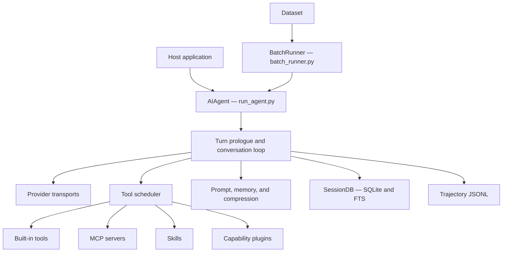
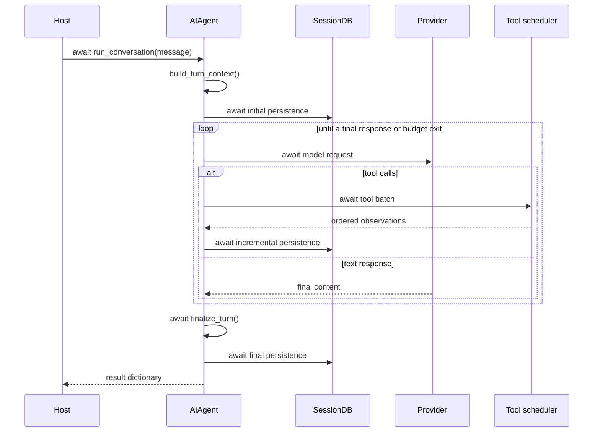

# Architecture

Async Hermes Agent is a library-focused derivative of Hermes Agent
`v2026.8.13`. It keeps upstream file locations and public names where possible,
then converts I/O-bearing runtime boundaries to coroutines. This makes upstream
changes easier to compare without maintaining a parallel async module tree.

## System overview



The host owns the event loop and service boundary. There is no bundled HTTP
server, interactive UI, messaging gateway, or scheduler in this distribution.

## Primary entry points

### `AIAgent`

`run_agent.py` exports `AIAgent`, the stateful agent runtime. Construction is
synchronous because it records configuration and creates no external
connection. The external lifecycle starts at the first awaited operation:

```python
from run_agent import AIAgent


async with AIAgent(...) as agent:
    result = await agent.run_conversation("Review this change")
```

`__aenter__()` resolves the provider runtime, discovers plugins, and starts MCP
discovery. `run_conversation()` also performs lazy initialization, so explicit
context-manager use is recommended but not required. `close()` releases MCP,
provider, database, browser, and child-task resources and is idempotent.

### `BatchRunner`

`batch_runner.py` consumes JSONL prompts and runs bounded concurrent agent
turns. Each prompt receives an isolated agent instance. Batch shards,
checkpoints, statistics, and a merged trajectory file are written with async
file operations. See [Trajectory Format](./trajectory-format.md).

## Code map

| Path | Responsibility |
| --- | --- |
| `run_agent.py` | `AIAgent` public API, lifecycle, and compatibility surface |
| `agent/conversation_loop.py` | Model/tool iteration and provider recovery |
| `agent/turn_context.py` | Once-per-turn setup, prompt restore/build, prefetch, and initial persistence |
| `agent/tool_executor.py` | Sequential and parallel-safe tool scheduling |
| `agent/turn_finalizer.py` | Result construction, trajectory save, cleanup, and final persistence |
| `agent/prompt_builder.py` | Stable system-prompt assembly |
| `agent/context_compressor.py` | Context pressure handling and summarization |
| `agent/transports/` | Native async model transports |
| `model_tools.py` | Tool discovery, schemas, and dispatch entry points |
| `tools/registry.py` | Tool registration and availability checks |
| `tools/mcp_tool.py` | MCP discovery, calls, reconnection, and teardown |
| `toolsets.py` | Static and dynamic tool group resolution |
| `hermes_state.py` | `SessionDB`, SQLite persistence, FTS search, and maintenance |
| `agent/trajectory.py` | Per-turn trajectory serialization |
| `batch_runner.py` | Concurrent dataset execution and checkpointing |

The reduced `hermes_cli/`, `gateway/`, `plugins/`, and `providers/` packages
contain retained configuration, context, and extension contracts used by the
library. They do not constitute the removed product applications.

## Turn data flow



## Concurrency model

- A per-instance `asyncio.Lock` serializes turns on one `AIAgent`. This keeps
  mutable history, prompt-cache state, and persistence ordered.
- Different agent instances can make progress concurrently on the same event
  loop.
- Parallel-safe tool calls run in an `asyncio.TaskGroup`; observations are
  appended in the model's original tool-call order.
- Tools requiring interaction, ordering, or a safety barrier remain
  sequential.
- CPU-only parsing, token estimates, schema normalization, and message
  transformations remain synchronous.

Native async means active I/O is awaited. It is a concurrency contract, not a
claim that every helper is a coroutine or that CPU work becomes cheaper.

## Behavior-preservation contracts

The async conversion keeps these upstream invariants:

- The system-prompt prefix remains stable for the life of a conversation.
- Provider message alternation and tool-call/tool-result pairing remain valid.
- Tool observations retain model-issued order even when execution overlaps.
- Reasoning, tool calls, observations, and final answers retain trajectory
  order and shape.
- Cancellation finalizes durable partial state before propagating
  `CancelledError` to the host.
- Hermes' internal interrupt path returns a partial result rather than being
  confused with task cancellation.

## Live acceptance verification

The default test suite is hermetic. Before a release, run the opt-in acceptance
paths with an authenticated provider to exercise the real async chain rather
than only mocked transports:

```bash
HERMES_LIVE_TESTS=1 HERMES_LIVE_PROVIDER=copilot \
  uv run pytest -q \
    tests/e2e/test_live_provider_tool_path.py \
    tests/e2e/test_live_provider_stream_path.py \
    tests/e2e/test_live_provider_extensions_path.py \
    tests/e2e/test_live_provider_state_path.py \
    tests/e2e/test_live_provider_timeout_path.py \
    tests/e2e/test_live_provider_concurrency_path.py \
    tests/e2e/test_live_provider_subagent_path.py \
    tests/e2e/test_live_provider_compression_path.py \
    tests/e2e/test_live_single_runner_path.py
```

These tests cover provider-to-tool observations and trajectory ordering, a real
stdio MCP server and skill loading, persistent memory and cross-instance
session resume, timeout cleanup and next-turn recovery. They also verify native
streaming, live context compression and continuation, the retained single-task
runner, overlapping requests across agent instances, per-agent turn
serialization, and background subagent reinjection and cleanup. Every path
fails on event-loop blocking or leaked tasks. Set `HERMES_LIVE_MODEL` to
override the provider's test default; OpenRouter runs also require
`OPENROUTER_API_KEY`.

A reasoning-capable provider is a separate release gate because the default
Copilot acceptance model does not expose reasoning. Point this test at an
already-running provider and model; for example, an LM Studio model loaded as
`async-hermes-reasoning` on its default port:

```bash
HERMES_LIVE_REASONING_TESTS=1 \
HERMES_LIVE_REASONING_PROVIDER=lmstudio \
HERMES_LIVE_REASONING_MODEL=async-hermes-reasoning \
  uv run pytest -q \
    tests/e2e/test_live_reasoning_trajectory_path.py \
    tests/e2e/test_live_batch_runner_path.py
```

Those paths require reasoning on both model turns and verify the saved
`reasoning → tool call → observation → reasoning → final answer` trajectory,
BatchRunner checkpoint/resume and merged JSONL output, and event-loop and task
cleanup. The BatchRunner gate intentionally has no non-reasoning default:
upstream data-generation behavior discards samples with zero reasoning.

## Persistence and ownership

`SessionDB` uses one lazily opened `aiosqlite` connection and async locks for
connection and write serialization. A `SessionDB` attached to an agent,
including one passed through `session_db=`, is closed by `AIAgent.close()`;
passing it transfers lifecycle ownership to that agent. Host callbacks and
configuration remain host-owned.

For details, continue with [Agent Loop Internals](./agent-loop.md),
[Session Storage](./session-storage.md), and
[Programmatic Integration](./programmatic-integration.md).

## Scope boundary

The original Hermes Agent product also includes CLI/TUI, desktop, dashboard,
messaging, ACP, and cron surfaces. They are intentionally absent here. Restore
them from upstream only when their complete behavior and native-async I/O path
can be carried together; do not add placeholders to the core.
